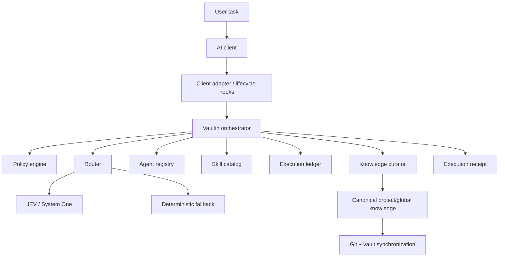

# Architecture

Vaultin is intentionally split into small subsystems so that routing, authorization, knowledge, Git synchronization, and execution evidence are not conflated.

## High-level architecture



## Design principles

### Canonical state is explicit

Vaultin has one authoritative knowledge plane:

- global knowledge under `knowledge/`;
- project knowledge under `vaults/projects/<slug>/`;
- policies under `policies/`;
- workflows under `workflows/`;
- agents under `agents/`;
- executable Agent Skills under `.agents/skills/`.

Replica repositories are projections, not peers.

### Routing is not authorization

The router chooses an execution owner/workflow. The policy engine decides whether an action is permitted.

JEV therefore cannot grant permissions.

If JEV fails, Vaultin may still select a deterministic route, but authorization rules remain unchanged.

### Failure should be visible

Vaultin is designed to block or surface degraded states instead of silently continuing with weaker guarantees.

Examples:

- invalid governance configuration blocks health;
- policy bootstrap failures block the execution;
- incomplete sync becomes `PENDING_SYNC` or `PARTIAL_SYNC`;
- replica divergence raises an explicit error;
- a session that ends before normal finalization is recorded as failed.

## Core subsystems

### Configuration

`src/vaultin/config.py` loads `vaultin.yaml` into a strict Pydantic model. Unknown fields are rejected.

This is important because typos in governance configuration should not be silently ignored.

### Health gate

`src/vaultin/runtime/health.py` verifies that these subsystems can initialize:

- configuration;
- policy;
- workflow state machine;
- agent registry;
- skill catalog;
- ledger.

The CLI exposes this through `vaultinctl health`, `doctor`, and `status`.

### Project discovery

`src/vaultin/projects/discovery.py` attempts to identify the current project from the Git `origin` remote.

Supported GitHub remote forms include HTTPS and SSH.

The source repository is inspected; Vaultin does not need to inject governance files into it.

### Agent registry

`agents/registry.yaml` maps agent names to profiles.

V1 currently defines ten core profiles:

- orchestrator;
- explorer;
- software-engineer;
- frontend-engineer;
- platform-engineer;
- security-reviewer;
- qa-engineer;
- code-reviewer;
- release-manager;
- knowledge-curator.

Routes that reference an unregistered agent are rejected.

### Skill catalog

`.agents/skills/catalog.json` is the canonical skill catalog.

Routing output is validated against this catalog. An unregistered skill is not accepted merely because a classifier produced its name.

### Routing

`src/vaultin/routing/jev.py` supports typed routing through the TypeSafe System One API.

The JEV path validates:

- returned schema;
- option membership;
- probability shape;
- probability sum;
- confidence ranges;
- registered agents;
- registered skills.

The decisions that select the primary agent and workflow are routing-critical and require the configured confidence floor.

Failures transition to the deterministic router in `src/vaultin/routing/fallback.py`.

The fallback uses explicit task keywords to select known agents/workflows. It does not evaluate policy.

### Policy engine

`src/vaultin/policy/engine.py` evaluates actions against layered policy:

1. critical Vaultin policy;
2. project policy;
3. project-native instructions;
4. explicit user authorization;
5. agent defaults.

A denial at a higher layer cannot be bypassed by a lower-priority allow.

The V1 core policy explicitly denies the `disable_governance` action.

### Orchestrator

`src/vaultin/orchestrator.py` coordinates durable execution.

It:

- creates the execution record;
- validates governance bootstrap;
- selects the route;
- tracks state transitions;
- evaluates action authorization;
- records validation evidence;
- writes the final execution receipt;
- renders the final state from recorded evidence.

### State machine

The canonical state machine is `workflows/state-machine.yaml`.

The normal lifecycle is:

```text
INITIALIZING
→ READY
→ ROUTED
→ EXECUTING
→ VALIDATING
→ CURATING
→ COMMITTING
→ SYNCING
→ COMPLETED
```

Failure/degraded states include:

```text
BLOCKED
FAILED
BREAK_GLASS
PENDING_SYNC
PARTIAL_SYNC
RETRYING_SYNC
ROLLED_BACK
```

Transitions are validated instead of letting callers arbitrarily rewrite execution state.

## Codex lifecycle integration

Vaultin's Codex plugin registers:

```text
SessionStart
UserPromptSubmit
PreToolUse
PostToolUse
Stop
Interrupt
SessionEnd
```

The hook entrypoint receives event payloads through stdin and returns its response through stdout.

The root is resolved in this order:

1. explicit `--root`;
2. `VAULTIN_ROOT`;
3. `~/.vaultin/root`.

Unhandled hook errors are appended to:

```text
~/.vaultin/hook-errors.log
```

and the hook exits non-zero.

### Important boundary

Vaultin detects what the client surface actually exposes.

Hook presence must not be described as a complete enforcement boundary unless the client can technically guarantee that behavior. The Codex adapter therefore reports its capability level conservatively.

## Durable execution ledger

Runtime paths are derived by `VaultinPaths`:

```text
.vaultin-runtime/vaultin.db
.vaultin-runtime/events.jsonl
.vaultin-runtime/sync-queue.jsonl
```

The ledger provides durable execution context across separate hook processes.

This matters because lifecycle hooks do not necessarily execute in one long-lived Python process.

## Execution receipts

Finalization writes a concise Markdown receipt to:

```text
memory/execution-receipts/YYYY/MM/<execution-id>.md
```

A receipt records:

- objective;
- project;
- final status;
- files changed;
- validations;
- Git SHAs;
- pending work.

Detailed operational data remains in the local runtime rather than bloating durable project memory.

## Knowledge curation

`KnowledgeCurator` classifies durable candidates as:

- `UPDATE`;
- `APPEND`;
- `SUPERSEDE`;
- `CREATE`;
- `IGNORE`.

The current implementation uses existing search hits and durability/scope metadata to decide whether knowledge belongs in project or global storage.

## Project vault model

For project `example-api`:

```text
Vaultin/vaults/projects/example-api/
```

is authoritative.

A replica such as:

```text
YOUR_GITHUB_USER/vault-example-api
```

can be created for projection/synchronization.

Synchronization:

1. commits the canonical Vaultin project path;
2. projects canonical files into the replica worktree;
3. writes `.vaultin-replica.json`;
4. commits the replica;
5. records both SHAs;
6. pushes both repositories;
7. queues failures durably when publication is incomplete.

### Divergence protection

Vaultin records the trusted replica SHA.

If the local or remote replica changes independently, synchronization raises `ReplicaDivergence`.

The replica never silently wins over canonical Vaultin content.

## MCP architecture

The MCP server exposes a small service rather than filesystem-wide access.

Allowed operations include:

- search canonical knowledge;
- read allowed canonical surfaces;
- write Markdown under an existing canonical project vault;
- inspect the registry.

Read access is limited to canonical top-level areas such as:

```text
knowledge/
memory/
vaults/
agents/
.agents/
policies/
workflows/
```

Path traversal and absolute paths are rejected.

Git publication is opt-in through `VAULTIN_MCP_ALLOW_PUBLISH`.

## Break-glass

Break-glass is a manual operational escape hatch.

It requires:

- explicit CLI invocation;
- a human-provided reason;
- a bounded TTL;
- audit evidence.

It must never be activated automatically by an agent.

## Trust boundaries

Vaultin does not claim to solve every security problem around AI coding clients.

Its useful boundaries are:

- strict canonical configuration;
- explicit policy evaluation;
- validated routing outputs;
- durable execution state;
- evidence-backed finalization;
- controlled canonical knowledge surfaces;
- synchronization divergence detection;
- explicit degraded states.

Client-level sandboxing, process isolation, OS permissions, and the actual semantics of third-party hook runtimes remain external boundaries and must be evaluated independently.
